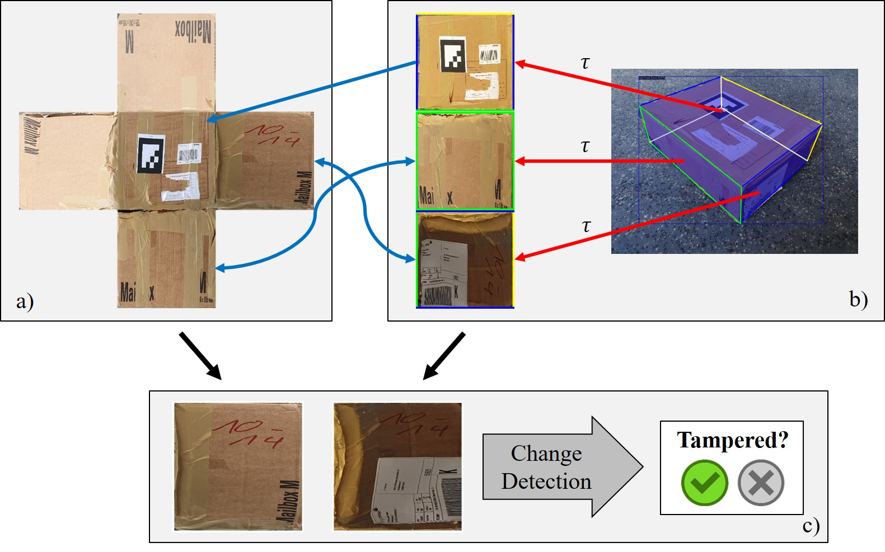
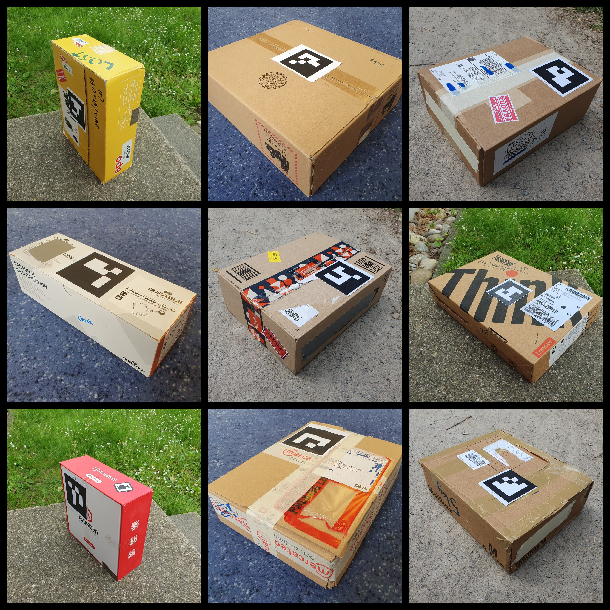

[](https://arxiv.org/abs/2311.03124)
[](https://a-nau.github.io/tampar)
[](https://github.com/a-nau/tampar/actions)

# TAMPAR

This repo was developed as part of our WACV '24 [paper](https://arxiv.org/abs/2311.03124) _"TAMPAR: Visual Tampering Detection for Parcels Logistics in Postal Supply Chains"_ ([citation](#citation)), also check
the [project page](https://a-nau.github.io/tampar/) for more details.

<p align="center">
    
    <br>
    <span style="font-size: small">
        <b>Figure:</b> 
        We detect tampering by comparing the full parcel texture from a database (a) with the
        viewpoint-invariant parcel side
        surfaces of a single image by exploiting parcel corner point predictions (b). Appearance
        change detection is performed for each
        pair of matching parcel side surfaces to identify tampering (c).
        © IEEE 2024.
    </span>
    <br>
</p>

## Usage

### Setup

We highly recommend to use the provided Devcontainer to make the usage as easy as possible:

- Install [Docker](https://www.docker.com/) and [VS Code](https://code.visualstudio.com/)
- Install VS Code Devcontainer extension `ms-vscode-remote.remote-containers`
- Clone the repository
  ```shell
  git clone https://github.com/a-nau/tampar.git
  ```
- Press `F1` (or `CTRL + SHIFT + P`) and select `Dev Containers: Rebuild and Reopen Container`
- Go to `Run and Debug (CTRL + SHIFT + D)` and press the run button, alternatively press `F5`

Afterwards

- Download the pre-trained SimSaC weights from [here](https://drive.google.com/drive/folders/119FRNCyrIXxxYrZi-_kbGrGFiQ1MSkAG) and paste them into `src/simsac/weight`
- Download the pre-trained keypoint detection weights from [here](https://drive.google.com/file/d/1TC8pC-iDBGSqkwEs7dtcY-ZKdUorm0Fz)

### Keypoint Detection

To run a training on our 5 [example images](data/tampar_sample/validation/) run:

```shell
python src/tools/train_maskrcnn.py --config-file ./src/maskrcnn/configs/test.yaml --gpus "0" --num-gpus 1 --num-machines 1
```

- To add your own dataset, you need to register in the [register_datasets.py](src/maskrcnn/data/register_datasets.py).
- To check your results qualitatively you can
  use [detectron_qualitative_evaluation.ipynb](src/notebooks/detectron_qualitative_evaluation.ipynb)

### Predict Tampering

We first need to compute all relevant similarity scores

```shell
python src/tools/compute_similarity_scores.py
```

Afterwards, we can train the decision tree and predict tampering using

```shell
python src/tools/predict_tampering.py
```

Note: This will run only on the sample data from [data/tampar_sample/](data/tampar_sample/).

## TAMPAR dataset

You can download the dataset from [Zenodo](https://zenodo.org/records/10057090).

<p align="center">
    
    <br>
    <span style="font-size: small">
      <b>Figure:</b> 
        Visual samples from TAMPAR.
        Check our <a href="https://a-nau.github.io/tampar/">project website</a> for more.
    </span>
    <br>
</p>

## Citation

If you use the code of our paper for scientific research, please consider citing

```latex
@inproceedings{naumannTAMPAR2024,
    author    = {Naumann, Alexander and Hertlein, Felix and D\"orr, Laura and Furmans, Kai},
    title     = {TAMPAR: Visual Tampering Detection for Parcels Logistics in Postal Supply Chains},
    booktitle = {Proceedings of the IEEE/CVF Winter Conference on Applications of Computer Vision},
    month     = {January},
    year      = {2024},
    note      = {to appear in}
}
```

## Affiliations

<p align="center">
    
</p>

## Credits

- We use [SimSaC](src/simsac/readme.md) inference code. Licensed under [GPL-3.0](https://github.com/SAMMiCA/SimSaC/blob/main/LICENSE) which applies to folder [src/simsac](src/simsac/)
- The [Mask R-CNN](src/maskrcnn/) is borrowed from [CubeRefine R-CNN](https://github.com/a-nau/CubeRefine-R-CNN) (See [License](https://github.com/a-nau/CubeRefine-R-CNN/blob/main/LICENSE.md)) and [this implementation](https://github.com/a-nau/image-selection-and-cnn-training) ([MIT License](https://github.com/a-nau/image-selection-and-cnn-training/blob/main/LICENSE)), which applies to folder [src/maskrcnn](src/maskrcnn/)

Unless otherwise stated, this repo is distributed under [MIT License](LICENSE).
